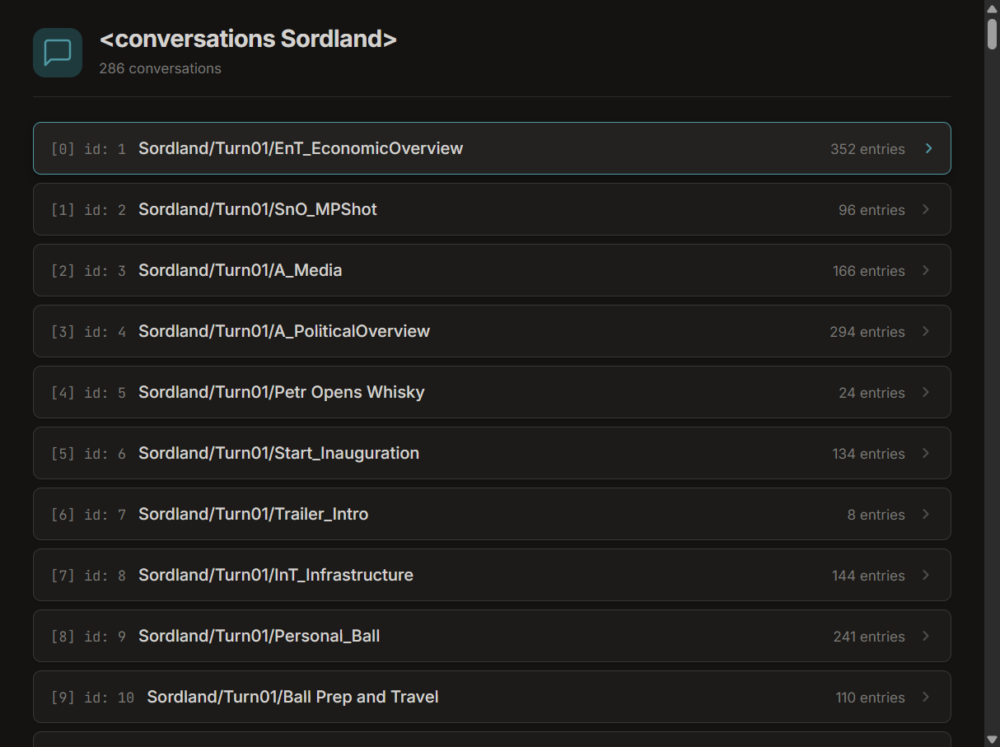
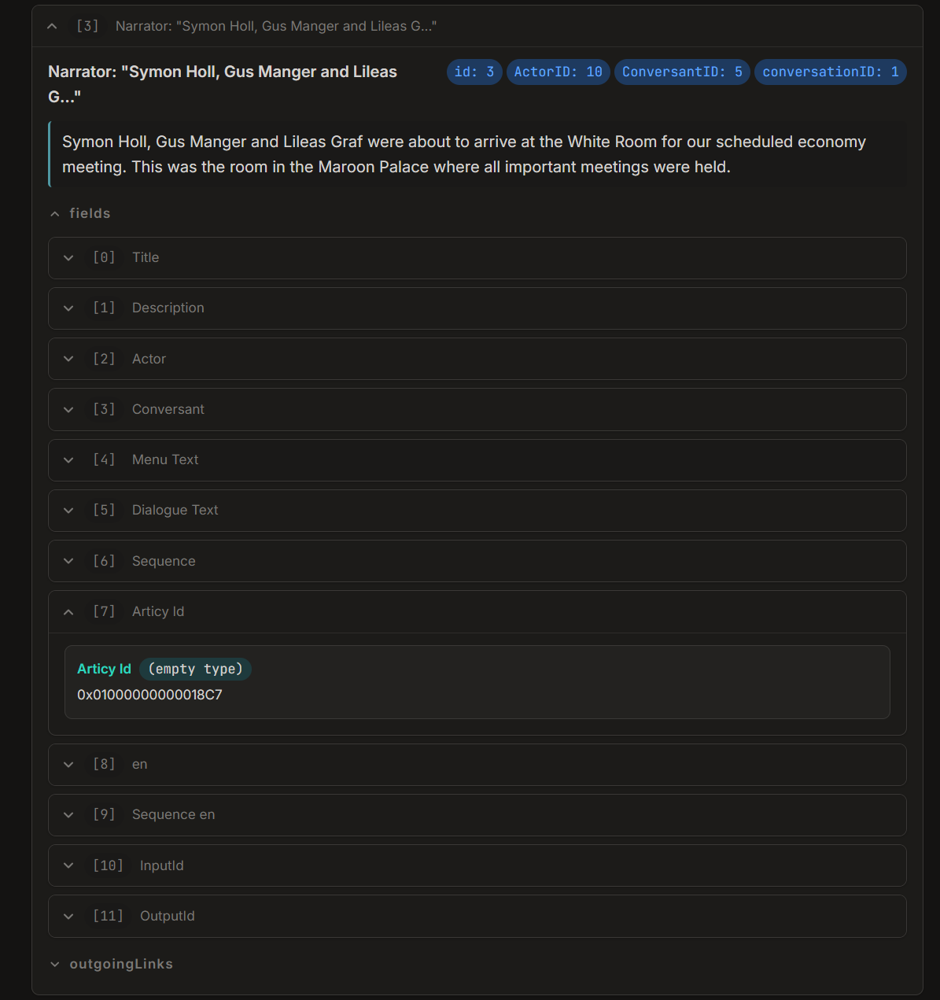

# Editing Conversations

This guide explains how to edit existing conversations. Note that adding new conversations is not yet supported. You can only add new nodes or override existing nodes in existing conversations.

## What Is a Conversation?

A conversation is a graph of nodes. A node can be a line of dialogue, a choice for the player, or just an empty node that connects other nodes.

## Injecting Nodes

New content is added via `ConversationInjection`. An injection contains a list of nodes and describes which conversation the nodes should be injected to.

```cs
// Target 'Sordland/Turn02/Personal_Funeral', which is Bernard Circas' funeral.
new ConversationInjection("Sordland/Turn02/Personal_Funeral")
    // Add a node to the injection.
    .AddNode(new ConversationNode(
        // The unique identifier of this node.
        name: "ExampleMod.PetrHello",
        // The text of this node.
        text: "Hello from Suzerain Modding Kit!",
        // Select the character that should speak this line.
        speakerSelector: new CharacterNameSelector("Petr Vectern"),
        // Which nodes should this node "hook" or attach to?
        hooks: [
            new ConversationNodeHook(
                // '0x0100000400008561' is "Dark clouds were looming over Deyr..."
                selector: new ConversationNodeArticyIDSelector("0x0100000400008561")),
        ],
        // Which nodes should this node continue on to?
        nextNodes: [
            new ConversationNodeModdedNameSelector("ExampleMod.PlayerHeyPetr"),
            new ConversationNodeModdedNameSelector("ExampleMod.PlayerHelloPetr"),
        ]))
    .AddNode(new ConversationNode(
        name: "ExampleMod.PlayerHeyPetr",
        text: "Hey Petr!"
        // 'speakerSelector' is omitted here and the next node,
        // which means that it will be a choice (the player speaks it).
        ))
    .AddNode(new ConversationNode(
        name: "ExampleMod.PlayerHelloPetr",
        text: "Hello Petr."))
    .Register();
```

Injections **must** be registered in `OnInitializeMelon`. `Register` will throw an exception if called after `OnInitializeMelon`.

### Important Types

What's happening here? First, let's look at the different types and what they do:

- `ConversationNode` represents one node in the conversation graph.
- `ConversationInjection` describes what you want to add or change in an existing conversation.
- `CharacterSelector` (subclasses: `CharacterNameSelector`, ...) describes a character that should be selected when it is time to resolve the conversation node. If the character cannot be resolved, the conversation node will be ignored.
- `ConversationNodeHook` contains a selector for a node to hook to and optionally describes how to hook it. In the example above, the "how to hook" arguments are omitted so the hook will just use the default hook strategy.
- `ConversationNodeSelector` (subclasses: `ConversationNodeArticyIDSelector`, `ConversationNodeModdedNameSelector`, ...) describes another node that should be selected when it is time to resolve this conversation node.

### Hooks

We see `hooks` in the example. What exactly is a "hook?" A hook is an object that describes which node to attach this node to.

What's the difference between hooks and next nodes? Notice that `nextNodes` can only be defined from within the node itself. We cannot add to a node's `nextNodes` from a different node. However, a node can hook to another node without the other node knowing about it.

So, **use hooks when you need to connect to a node you don't control** and **use next nodes when you are connecting a node you do control** to another node.

Hooks are also very powerful. There are a few properties we don't see in the example:

- `mode` defines the `HookMode` that should be used when hooking to the target node. There are three hook modes:
    - `Split` (default): Break the chain immediately after the target and insert this node in-between. For example, if we have the existing chain: `A -> B -> C` and we hook `D` to `A` using `Split`, the new chain will be: `A -> D -> B -> C`. This is the default and the safest option because all existing nodes will still trigger.
    - `ConditionGated`: Choose the first (sorted by priority) outgoing link with a successful condition. For choices, all with successful conditions will show. **This should be used when adding a new choice to a list of choices.**
        - Dialogue example: If we have the existing chain of **dialogue lines**: `A -> B -> C` and we hook `D` to `A` using `ConditionGated`, the new chain will be `A -> ((B -> C) OR D)`. `(B -> C)` or `D` will be selected based on their priorities and conditions. If neither have a condition, the one with the highest priority will be selected.
        - Choices example: If we have the existing chain of **choices**: `A -> [B, C]` and we hook `D` to `A` using `ConditionGated`, the new chain will be `A -> [B, C, D]`. All choices with successful conditions will show. This is why `ConditionGated` should be used when adding a new choice to a list of choices.
    - `Override`: Delete all other outgoing links and add this node. For example, if we have the existing chain: `A -> B -> C` and we hook `D` to `A` using `Override`, the new chain will be: `A -> D`. This is the most dangerous option and should generally not be used unless you are fundamentally rewriting a conversation.
- `priority` defines the `HookPriority` that should be used when resolving the hook. There are three priorities: `Low`, `Normal` (default), and `High`.

### Articy IDs

Notice that when we reference the "Dark clouds were looming over Deyr..." node, we use the identifier `0x0100000400008561`. All vanilla nodes have "Articy IDs," which is what we are referencing here.

To find the Articy ID of a node, we need to dump and inspect the game data. See [Inspecting Game Data](./inspecting-game-data.md) to set up Suzerain Data Dumper and Suzerain Data Viewer.

Using Suzerain Data Dumper, dump the conversations of the story pack you want. Then, run Suzerain Data Viewer and select the generated JSON to generate a static site. Open the `out/index.html` file generated by Suzerain Data Viewer.



Select the conversation you want to look in. Find and expand the node you want, expand the `fields` dropdown, then expand the field titled `Articy Id`.



### Conditions, Scripts, and Sequences

You can also pass the `luaCondition`, `luaScript`, and `sequence` arguments to `ConversationNode`.

- `luaCondition` is the Lua script that must resolve to `true` to show this node. See [Lua in the Dialogue System](lua-dialogue-system.md).
- `luaScript` is the Lua script that will execute when the line is spoken. See [Lua in the Dialogue System](lua-dialogue-system.md).
- `sequence` is the conversation-related actions to perform when this line is spoken. See [ConversationNodeSequenceBuilder](../../api/SuzerainModdingKit.Utils.ConversationNodeSequenceBuilder.yml).

